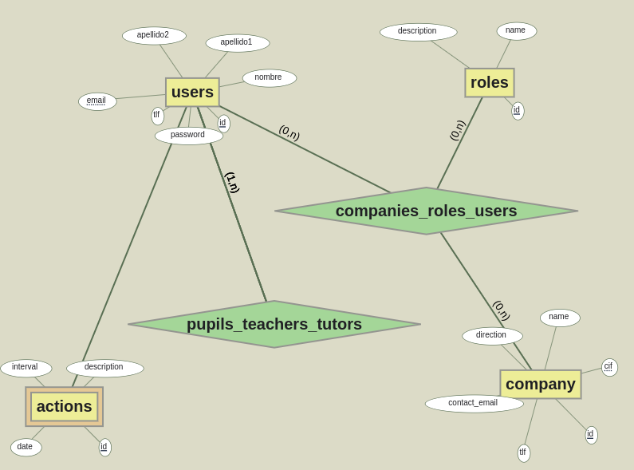

# 📘 sistemaPracticasFP

Nos proponemos crear una aplicación web para la gestión de las actuaciones que realizan los alumnos en su período de formación en empresas dentro de la Formación Profesional.  

Un alumno se conecta y guardará sus acciones acometidas de cada jornada de trabajo en su formación. En esta aplicación también podrán entrar y supervisar las acciones el profesor tutor asignado del centro educativo y el tutor laboral del alumno en la empresa.  

---

## 🏷️ **Roles dentro del sistema y casos de uso**  

### 🌍 **Usuario no identificado**  
- 🔑 Iniciar sesión en el sistema  

### 🛠️ **Usuario Administrador**  
- 🏫 CRUD de alumnos  
- 🎓 CRUD de profesores tutores  
- 🏢 CRUD de tutores laborales  

### 📚 **Usuario Profesor Tutor**  
- 👨‍🎓 CRUD de alumnos  
- 📝 CRUD de acciones de sus alumnos  
- 📄 Generar PDF de acciones de alumnos _(lo dejaremos para el final)_  

### 🏢 **Usuario Tutor Laboral**  
- 👀 Ver acciones de sus alumnos  
- 👨‍🎓 Ver alumnos  

### 👨‍🎓 **Usuario Alumno**  
- 📝 CRUD de acciones en la empresa  

---

## 🛠️ **Modelo Entidad-Relación (aproximado)**  

---

📌 **Nota:** Todos los usuarios identificados podrán cambiar sus datos y su contraseña.  
